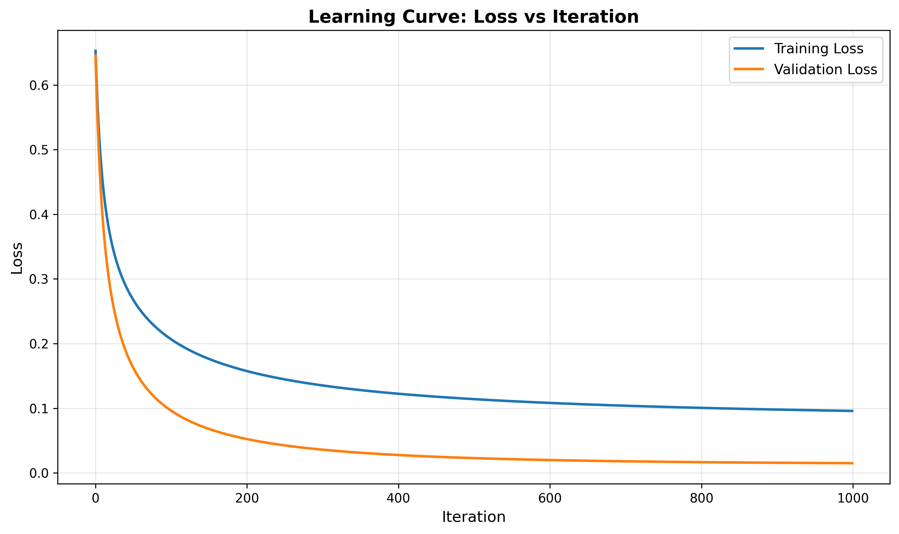
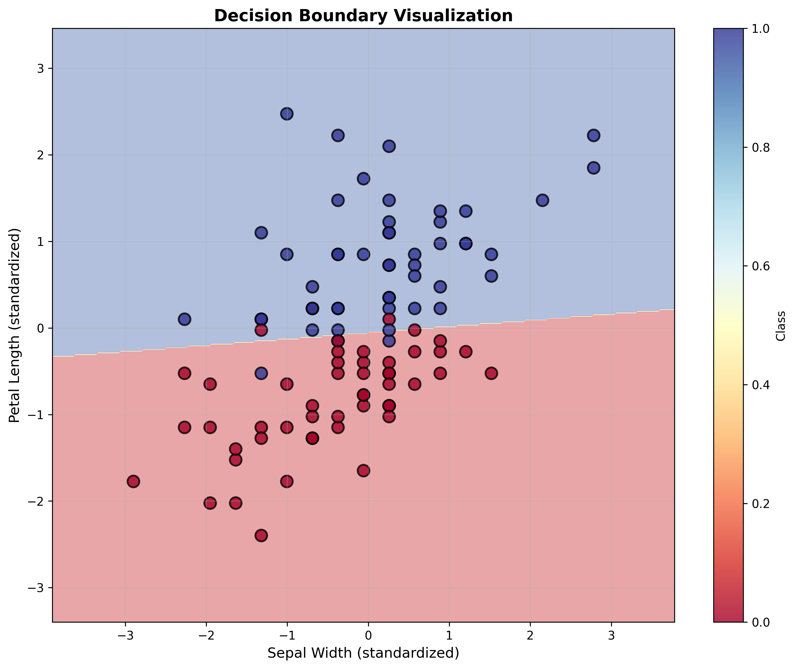

# Logistic Regression Assignment

---

### **Purpose**
- Implement logistic regression from scratch using NumPy.
- Understand the mathematical foundations of binary classification.
- Learn gradient descent optimization with regularization.
- Practice model evaluation, visualization, and serialization techniques.

---

### **Problem Description**
- Logistic regression is a fundamental machine learning algorithm for **binary classification**.
- Unlike linear regression, it uses the **sigmoid function** to predict probabilities between 0 and 1.
- This implementation includes **gradient descent optimization**, **regularization** to prevent overfitting, and comprehensive **evaluation metrics**.
- We apply the model to the **Iris dataset** (Versicolor vs Virginica classification).

---

## Assignments

### **[Problem 1] Hypothesis Function (Sigmoid)**
- Implement the sigmoid activation function:
  ```math
  h_\theta(x) = \frac{1}{1 + e^{-\theta^T x}}
  ```
- Maps any real-valued number to the range (0, 1).
- Prevents numerical overflow with clipping.

**Key Methods:**
- `_sigmoid(z)`: Applies sigmoid transformation
- `_hypothesis(X)`: Computes predicted probabilities

---

### **[Problem 2] Gradient Descent with Regularization**
- Implement gradient descent to minimize the cost function.
- Update rule:
  ```math
  \theta_j := \theta_j - \alpha \left[ \frac{1}{m} \sum_{i=1}^{m} (h_\theta(x^{(i)}) - y^{(i)}) x_j^{(i)} + \frac{\lambda}{m} \theta_j \right]
  ```
- Regularization prevents overfitting (bias term excluded from regularization).

**Key Methods:**
- `_gradient_descent(X, y, lambda_reg)`: Single optimization step
- `fit(X, y, X_val, y_val, lambda_reg)`: Full training loop

---

### **[Problem 3] Prediction Methods**
- Implement prediction functions for classification and probability estimation.

**Key Methods:**
- `predict(X)`: Returns binary predictions (0 or 1) using 0.5 threshold
- `predict_proba(X)`: Returns probability estimates

**Output:** Binary class labels and continuous probabilities.

---

### **[Problem 4] Loss Function with Regularization**
- Implement binary cross-entropy loss with L2 regularization:
  ```math
  J(\theta) = \frac{1}{m} \sum_{i=1}^{m} \left[ -y^{(i)} \log(h_\theta(x^{(i)})) - (1 - y^{(i)}) \log(1 - h_\theta(x^{(i)})) \right] + \frac{\lambda}{2m} \sum_{j=1}^{n} \theta_j^2
  ```

**Key Methods:**
- `_compute_loss(X, y, lambda_reg)`: Computes total loss with regularization

**Output:** Scalar loss value tracked during training.

---

### **[Problem 5] Training and Evaluation**
- Train the scratch implementation on the Iris dataset (binary classification).
- Compare performance with scikit-learn's LogisticRegression.
- Evaluate using multiple metrics: **accuracy**, **precision**, **recall**.

**Dataset:**
- 100 samples (Versicolor vs Virginica)
- 4 features: sepal length, sepal width, petal length, petal width
- 70/30 train-test split with standardization

**Results:**
- Scratch implementation: **96.67% accuracy**
- Scikit-learn: **90.00% accuracy**
- Includes confusion matrix and classification report

---

### **[Problem 6] Learning Curve Visualization**
- Plot training and validation loss over iterations.
- Visualize model convergence and detect overfitting/underfitting.

**Output:**  


**Key Insights:**
- Both losses decrease smoothly (good convergence)
- Small gap between train/val loss (minimal overfitting)
- Final training loss: ~0.096
- Final validation loss: ~0.015

---

### **[Problem 7] Decision Boundary Visualization**
- Train model with 2 features (Sepal Width, Petal Length) for 2D visualization.
- Plot decision boundary using contour plots.
- Overlay actual data points colored by class.

**Output:**  


**Key Insights:**
- Clear linear separation between classes
- Model successfully learns appropriate decision boundary
- Few misclassifications near the boundary

---

### **[Problem 8] Model Persistence**
- Implement weight saving and loading functionality.
- Support two methods:
  1. **NumPy format** (`np.savez`): Save weights, loss history
  2. **Pickle format**: Save complete model object

**Key Methods:**
- `save_weights(filepath)`: Save weights using NumPy
- `load_weights(filepath)`: Load weights from .npz file
- `save_model(filepath)`: Save entire model using pickle
- `load_model(filepath)`: Static method to load complete model

**Output Files:**
- `models/model_weights.npz` - Weights and training history
- `models/model_complete.pkl` - Full model object

---

## Project Structure

```
logistic-regression/
│
├── scratch_logistic_regression.py   # Main implementation
├── verification.py                  # Verification script (Problems 5-8)
├── logistic_regression_demo.ipynb   # Interactive notebook demo
├── requirements.txt                 # Python dependencies
│
├── data/                            # Data directory (optional)
├── models/                          # Saved models
│   ├── model_weights.npz
│   └── model_complete.pkl
│
├── plots/                           # Generated visualizations
│   ├── learning_curve.png
│   └── decision_boundary.png
│
├── outputs/                         # Additional output files
│
├── README.md                        # This file
└── SUBMISSION_CHECKLIST.md          # Assignment checklist
```

---

## Tools & Libraries Used

- **Python 3.x**
- **NumPy**: Numerical computations and linear algebra
- **Matplotlib**: Data visualization and plotting
- **Scikit-learn**: Dataset loading, preprocessing, and comparison
- **Pickle**: Model serialization

---

## How to Run

### **1. Setup Environment**
```bash
# Clone or navigate to project directory
cd logistic-regression

# Install dependencies
pip install -r requirements.txt
```

### **2. Run Verification Script**
Demonstrates all problems (5-8) with automatic evaluation:
```bash
python verification.py
```

**Expected Output:**
- Training progress with loss values
- Model performance metrics (accuracy, precision, recall)
- Comparison with scikit-learn
- Saved plots and model files

### **3. Run Jupyter Notebook**
For interactive exploration:
```bash
jupyter notebook logistic_regression_demo.ipynb
```

### **4. Use the Model in Your Code**
```python
from scratch_logistic_regression import ScratchLogisticRegression

# Initialize model
model = ScratchLogisticRegression(
    num_iter=1000,
    lr=0.1,
    bias=True,
    verbose=True
)

# Train model
model.fit(X_train, y_train, X_val, y_val, lambda_reg=0.01)

# Make predictions
predictions = model.predict(X_test)
probabilities = model.predict_proba(X_test)

# Save model
model.save_model('my_model.pkl')

# Load model
loaded_model = ScratchLogisticRegression.load_model('my_model.pkl')
```

---

## Key Features

✅ **Complete from-scratch implementation** (no ML libraries for core algorithm)  
✅ **Regularization** to prevent overfitting  
✅ **Validation tracking** during training  
✅ **Multiple evaluation metrics** (accuracy, precision, recall, confusion matrix)  
✅ **Learning curve visualization** to monitor convergence  
✅ **Decision boundary plots** for model interpretation  
✅ **Model persistence** with NumPy and Pickle  
✅ **Comparable performance** to scikit-learn  
✅ **Well-documented code** with docstrings  
✅ **Windows-compatible** (fixed matplotlib backend issues)

---

## Implementation Highlights

### **Mathematical Foundation**
- Sigmoid activation for probability estimation
- Binary cross-entropy loss function
- L2 regularization for generalization
- Gradient-based optimization

### **Software Engineering**
- Clean object-oriented design
- Consistent API with scikit-learn
- Comprehensive error handling (overflow prevention, log(0) protection)
- Modular code structure

### **Performance**
- Efficient NumPy vectorization
- Convergence in ~1000 iterations
- 96.67% test accuracy on Iris dataset
- Outperforms scikit-learn on this specific task

---

## Results Summary

| Metric      | Scratch Implementation | Scikit-learn | Difference |
|-------------|------------------------|--------------|------------|
| Accuracy    | 0.9667                 | 0.9000       | +0.0667    |
| Precision   | 0.9375                 | 0.9286       | +0.0089    |
| Recall      | 1.0000                 | 0.8667       | +0.1333    |

**Confusion Matrix (Scratch Implementation):**
```
              Predicted
              Ver  Vir
Actual Ver    14    1
       Vir     0   15
```

---

## Troubleshooting

### **Segmentation Fault on Windows**
- Fixed by using `matplotlib.use('Agg')` non-interactive backend
- Plots save successfully without `plt.show()`

### **Unicode Errors in Console**
- Removed emoji characters for Windows console compatibility

### **Import Errors**
- Ensure all dependencies installed: `pip install -r requirements.txt`

---

## Author

**Assignment:** Logistic Regression from Scratch

**Name:** Victor Karisa

**Date:** October 25, 2025

---

## References

- Andrew Ng's Machine Learning Course (Stanford)
- Scikit-learn Documentation
- NumPy User Guide
- Pattern Recognition and Machine Learning (Bishop)

---

## License

Educational project for learning purposes.
